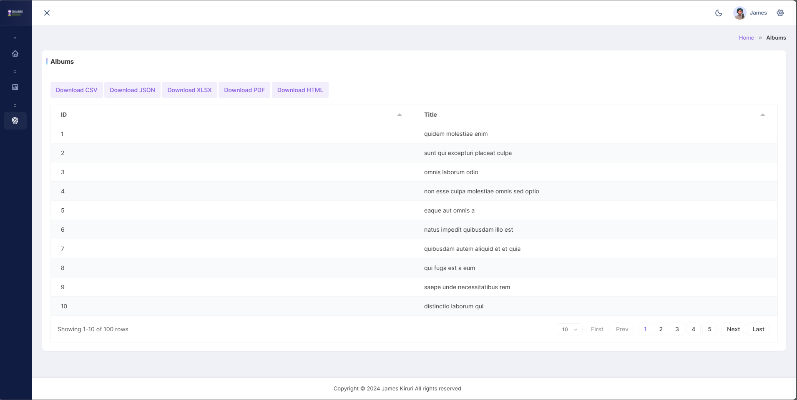

# Project Overview

In this assessment, I have successfully implemented a backend system using Laravel that includes the following features:

## Features Implemented

### 1. User Management
- **Show Users:** 
  - I have developed functionality to list all the users in the system.
  - Each user's information is displayed in a tabular format.

### 2. Album Management
- **Show Albums:**
  - I have implemented a feature to display all albums in the system.
  - Each album is listed with its respective details.
  
- **Show User's Albums:**
  - I can filter and display albums specific to a user.
  - This helps in managing and viewing albums owned by individual users.

### 3. Photo Management
- **Show Photos in an Album:**
  - For each album, I have provided functionality to view all photos contained within it.
  - Photos are displayed with their details including URL and a thumbnail image.

### 4. Authentication
- **User Authentication:**
  - I have implemented user authentication to secure the application.
  - Users must log in to access certain parts of the application.

- **Route Protection:**
  - Routes are protected using tokens to ensure that only authenticated users can access specific endpoints.
  - This prevents unauthorized access and enhances the security of the system.

## Screenshots

Below are the screenshots demonstrating the different parts of the application:

### 1. User Listing

### 2. Album Listing

### 3. User's Albums

### 4. Photos in an Album

### 5. Authentication

## How to Use the System

1. **Log in to the system:**
   - Navigate to the login page.
   - Enter your credentials to authenticate.

2. **Navigate through the sections:**
   - Use the menu to navigate to Users, Albums, and Photos sections.
   - View the details by clicking on the respective links.

3. **Protected Routes:**
   - Certain routes are protected and require authentication.
   - Ensure you are logged in to access these routes.

## Conclusion

I have successfully developed a robust backend system with essential features for user, album, and photo management. The implementation of authentication and route protection enhances the security and usability of the application.

Feel free to explore the system and refer to the screenshots for a visual understanding of the functionalities. If you have any questions or need further assistance, please contact me.

---

For more detailed setup instructions, please refer to the [README.md](README.md) file.
